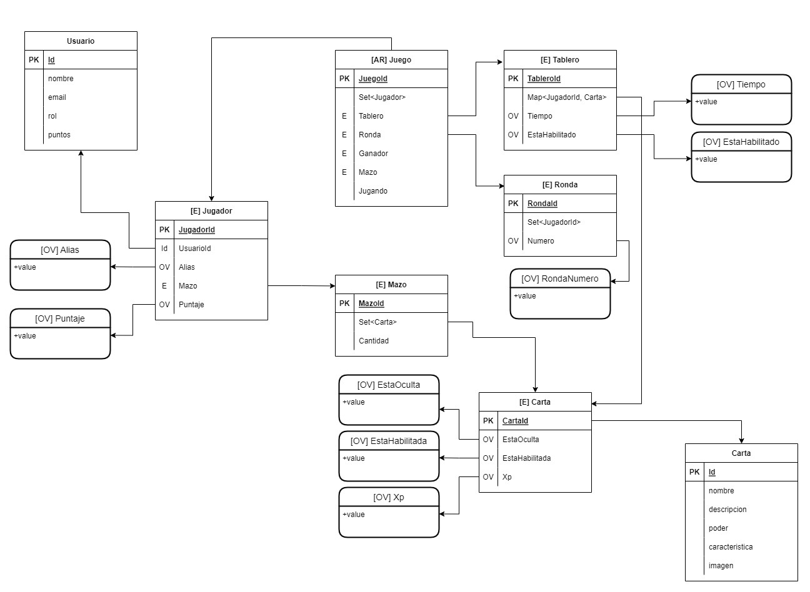

# ChallengeFullStackGame

## Table of Contents
1. [Información General](#informacion-general)
2. [Reglas del Juego](#reglas-del-juego)
3. [Modelo de Dominio](#modelo-de-dominio)
4. [Modelo Web en Figma](#modelo-web-en-figma)

### Información General
***
<p>
    Juego de cartas basado en los Superhéroes de Marvel y
    los acontecimientos más relevantes ocurridos durante las diferentes sagas de comics.
</p>
    
<p>
    Cada jugador cuenta con un mazo de cartas repartidas al azar, 
    cada una de estas tiene un puntaje de poder asignado. Los jugadores tienen
    <b>máximo 60 segundos</b> para elegir una carta y apostarla en el tablero, luego de
    este tiempo las cartas serán reveladas y el jugador con la carta de poder
    mayor se quedará con las cartas de los demás oponentes. 
</p>

<p>
    El juego finaliza cuando uno de los jugadores logre quedarse con <b>todas las cartas</b>.
</p>

<p style="text-align: center">
    <b>2-6 jugadores</b>.
</p>

### Screenshot


## Reglas del Juego
***
* Al iniciar el juego se reparte las tarjetas a cada jugador de forma aleatoria y se tiene diferentes rondas, cada ronda los jugadores colocan una tarjeta de forma tal que los demás jugadores no sepan cuál es.

* El jugador tiene un minuto para poner una tarjeta en el tablero, de lo contrario el
sistema de forma automática selecciona una tarjeta del mazo de tarjetas del jugador.

* Luego que todos los jugadores pongan su tarjeta apostada, la tarjeta que sume más
puntos gana, significa que el jugador que tenga la mejor tarjeta se lleva las demás
tarjetas que están en el tablero.

* El jugador que adquiere las tarjetas de los demás jugadores puede usar esas
mismas tarjetas durante el juego (es decir la puede apostar).

* El juego finaliza cuando los jugadores quedan sin tarjetas y solo uno de ellos queda
con todas las tarjetas.

## Modelo de Dominio
***
A continuación se presenta el esquema de las entidades planteadas para la solución. 
```
$ git clone https://example.com
$ cd ../path/to/the/file
$ npm install
$ npm start
```
Side information: To use the application in a special environment use ```lorem ipsum``` to start

## Modelo Web en Figma
***
Give instructions on how to collaborate with your project.
> Maybe you want to write a quote in this part. 
> It should go over several rows?
> This is how you do it.
